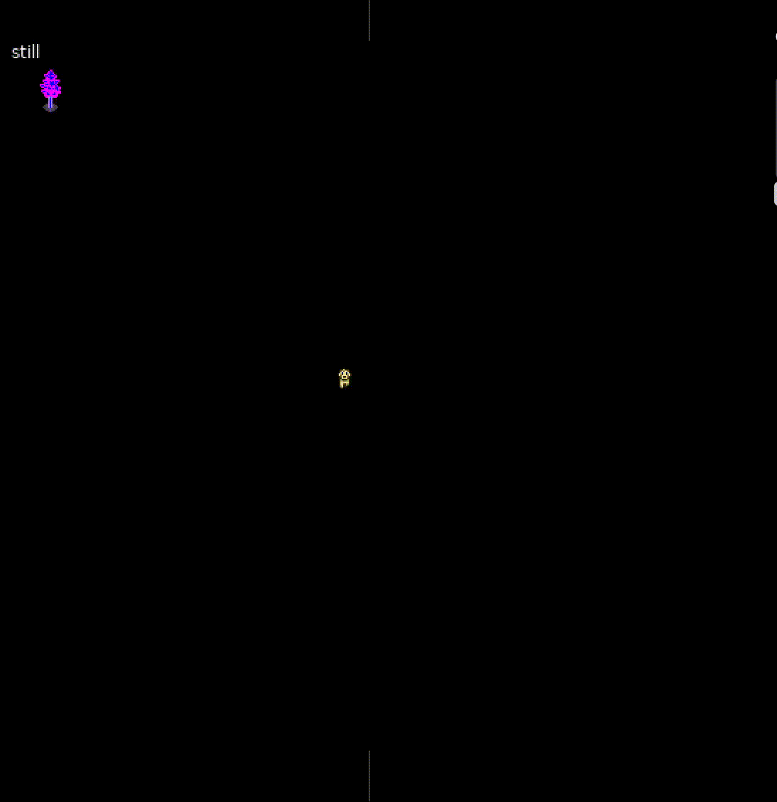

# ```CITYSHELL```
   

> welcome to the metropolis!
> were so glad you could [make] it.
> keep on' buildin'!


## ```color definitions```

## ```----> the prompt ---->```

```html
<p>this</p>
```
## Build Instructions 
to build, run ```make```.
feel free to modify the makefile,
i have it configured in such a way where the resulting binary 
```city``` is linked to ```/tmp/bin/city```, and if this directory
does not exist, we ```mkdir -p /tmp/bin/city```.
in terms of a compiiler, in this ```makefile``` i am using ```cc``` for portability,
and the project was mainly intended to 
operate in symbiosis with the greater llvm ecosystem
> add ```/tmp/bin/``` to your `$PATH` by saying:
`PATH=$PATH:/tmp/bin/`.
furthermore, you could add the statement `export PATH=$PATH:/tmp/bin` to your rc-
> this is configured for debugging purposes and must copy the binary to an alternative directory in your path.

# ```luajit``` or ```python3```
> cityshell was intended to be scripted in lua, but accepts python3

## 

>
>> ```keep in mind, while we only use 8 colors,
>> there is nothing preventing us from mixing up the palette!```
>


```c
   
```
