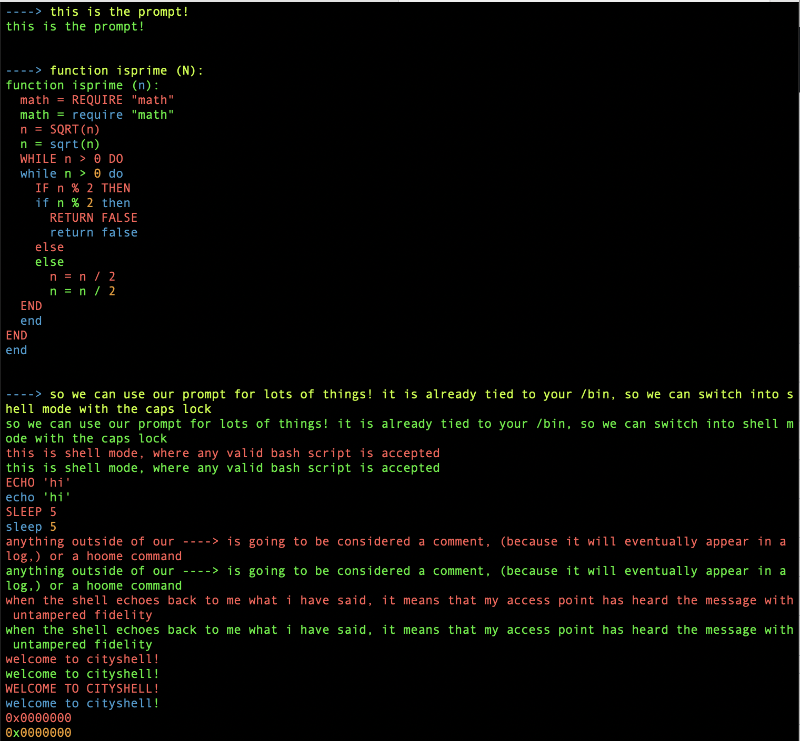

# ```CITYSHELL```
   
>
>>welcome to the metropolis!
>>were so glad you could [make] it.
>>keep on' buildin'!
>

## COLOR DEFINITIONS

## 

>
>> ```keep in mind, while we only use 8 colors,
>> there is nothing preventing us from mixing up the palette!```
>



```c
   
```
